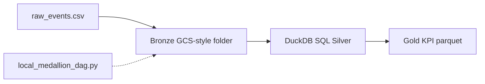

# GCP Data Platform Lab (Local DuckDB Medallion)

**Author:** Faiz Elahi ([GitHub @faizelahi](https://github.com/faizelahi))  
**Type:** Educational lab only — synthetic data, no cloud spend, no API keys, no live Terraform apply.

---

## The problem this lab teaches

Teams landing clickstream in GCS and curating KPI tables in BigQuery need repeatable medallion patterns. This lab practices that **design** without a GCP project.

## Why this tool / pattern matters

Medallion (bronze/silver/gold) keeps raw history, cleaned conforming models, and business aggregates separate — the same idea behind BigQuery datasets fed by Composer.

## Architecture (local simulation)



Honest mapping: this repository **simulates** cloud concepts on your laptop. Names like BigQuery, S3, Snowpipe, or Healthcare API appear in documentation to help you interview and design real systems — but **nothing here calls vendor APIs or creates billable resources**.

## Data dictionary (synthetic)

| File | Grain | Key columns | Notes |
|------|-------|-------------|-------|
| `raw_events.csv` | event | event_id, user_id, amount_usd | Landing feed |
| `dim_users.csv` | user | user_id, country, segment | Dimension |

## Prerequisites

- Python 3.10+
- Windows, macOS, or Linux

## How to run

```powershell
cd "github-portfolio/gcp-data-platform-lab"
python -m venv .venv
.venv\Scripts\activate
pip install -r requirements.txt
python scripts/generate_synthetic_data.py
python scripts/generate_charts.py
python -m src.run_lab
```

On macOS/Linux use `source .venv/bin/activate` instead of `Scripts\activate`.

## Walkthrough (teacher voice)

1. Generate CSVs. 2. Open `src/run_lab.py` and read the SQL — notice join filters and aggregates mirror BigQuery jobs. 3. Run the DAG skeleton and compare its task list to `run_lab`. 4. Inspect parquet under `data/bronze|silver|gold`.

## Expected outputs

- Console prints top 5 `gold_daily_revenue` rows.
- Parquet files in three layer folders.
- Charts in `docs/images/`.

## Glossary

- **Bronze:** immutable raw landing.
- **Silver:** cleaned, joined, business keys.
- **Gold:** aggregated KPIs.
- **Composer:** managed Airflow on GCP.

## Common mistakes students make

- Skipping venv and blaming DuckDB DLL errors on Windows.
- Treating local folders as proof of GCP certification.
- Forgetting LEFT JOIN semantics when users missing.

## Exercises (try without peeking at answers)

1. Add a DQ check rejecting `amount_usd > 500`. 2. Extend gold with revenue by `country`. 3. Sketch a Composer schedule (cron) for daily runs.

## Limitations (read before putting this on a resume)

No BigQuery slots, no IAM, no Dataflow. Say "implemented medallion pattern locally" not "built production GCP pipeline" unless you did that elsewhere.

## License

MIT — educational use. Synthetic data only.


## Extended teacher notes

Take your time with the architecture diagram in `docs/architecture.md` and the PNG charts in `docs/images/`.
When you explain this project in an interview, lead with **what problem the cloud service solves**, then mention this repo as a **local pattern practice** — interviewers appreciate honesty about scope.

### Reflection questions

- What would you monitor in production that we skip here?
- Where would IAM and encryption sit in the real cloud diagram?
- Which test would prove data quality before promoting to gold?

### Answer sketches (for self-check)

- Monitoring: job failures, row counts, freshness SLAs, cost anomalies.
- Security: least-privilege roles, KMS/Vault keys, private endpoints.
- DQ: null rates, referential integrity, duplicate keys, schema contracts.


## Module 1 — Landing zone mental model

Before you run code, draw three buckets on paper: **bronze**, **silver**, and **gold**. Bronze is append-only history — never delete a bad file, quarantine it. Silver applies typing, deduplication, and conformed keys. Gold answers a business question in one glance (daily revenue, active users, etc.). In Google Cloud, those buckets often become GCS prefixes and BigQuery datasets; here they are folders under `data/` plus DuckDB tables.

## Module 2 — SQL you should read aloud

Open `src/run_lab.py` and narrate the silver transform: we filter negative amounts (data quality), join users (enrichment), and aggregate by day (gold). That sequence appears in almost every GCP analytics interview loop: ingest → cleanse → serve.

## Module 3 — Composer without the cluster

`src/dags/local_medallion_dag.py` is intentionally boring: three task names, stdout only. Boring is good pedagogy — you map each task to a real Airflow operator later (`GCSObjectExistenceSensor`, `BigQueryInsertJobOperator`, etc.).

## Module 4 — Portfolio wording (Faiz Elahi / @faizelahi)

Good bullet: "Authored an educational GCP medallion lab (synthetic data) demonstrating BigQuery-style SQL and Composer DAG structure locally." Avoid: "Built enterprise GCP pipeline" unless you operated production projects.

## Additional exercises

4. Materialize a `data_quality` table counting null `user_id` values per day.
5. Add unit tests with pytest for row counts between bronze and silver.
6. Write a one-page doc comparing DuckDB files vs BigQuery external tables.
